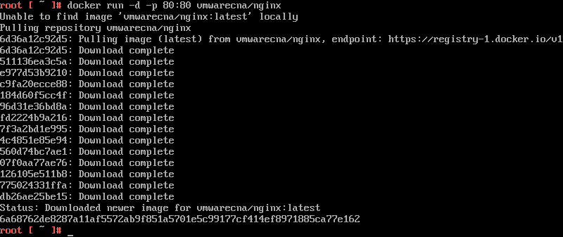

In the search for a thin yet efficient and powerfull host, VMWate Photon is a promising bet to become a good host for guest containers.

Using technologies like Docker to build self-contained solutions is a very sleek and eficient way to achieve modular and reusable building block services. In that way we must focus in the performance of the guest and the eficiency of the host.

Is mandatory to find a host OS that uses as less resources as posible and to ensure the guest containers to absorbe the memory and power they reqiere without compromises and here is where VMWare Photon fits perfectly offering many features like:

+ Compatibility supporting the most popular containers like Docker, rkt, garden, etc.
+ Very small size. About 300MB.
+ Can run over vmware virtualizations solutions and also Vagrant and other platforms.

### Setup Photon step by step

Let's setup a photon box on top of a vmware workstation and put a dockerized Nginx inside it.

+ **Download Photon ISO image**

  You can get a _pre-built_ Photon ISO image easily from: [VMWare Photon Oficial Site](https://vmware.github.io/photon/). Go to section _Getting Photon_.

+ **Create virtual machine on vmware workstation 11**

  - Select the **Photon ISO** image

    # 

  - Select **Linux** and **_Other Linux 3.x kernel 64-bit_**

    # 

  - Set **name** and **location** the new virtual machine 

    # 

  - Select disk **size** and **type**

    # 

  - Select customize hardware and **remove** devices we don't need like **printer**, **sound card** and **usb**.

    # 

  - Ready to run Photon VM. Select **Power On**.

    # 

+ **Install Photon**

  - After the VM boots, select the install option and then accept license agreement 

    # 

  - Select the target disk to install the OS, in this case only one disk is available 

    # 

  - Select the type of installation.  It depends on your needs. For this case scenario we will take option 2: **Minimal** because Docker manager is included in this one and up. If you want to know what is included in each option you can find out in the [Photon Github](https://github.com/vmware/photon/blob/master/installer/package_list.json)

    # 

  - Choose a hostname 

    # 

  - Choose a password

    # 

  - Wait for the installation to finish and restart

    # 

  - Login with root and your password

    # 

+ **Download and run a Nginx containter to test the stack**

  - Start and enable Docker engine
  
      `systemctl start docker` 
	  `systemctl enable docker`
    # 

  - Download and run a basic Nginx container (vmwarecna/nginx).
  
      `docker run -d -p 80:80 vmwarecna/nginx`
    # 

### Testing

  - Find out the container IP with `ifconfig` command

    # 

  - Browse to that IP to confirm that Nginx is up and running

    # 

### Conclusions

As you can see, it's very easy to setup a Photon box and even more easy to run a Docker container inside it. There are endless possibilities and you are free to explore.

Also, it's worth to mention that Photon can run not only over vmware products, also you can run it along with Vagrant, Google Compute Engine, Hashicorp Atlas, etc.

Since Photon is an open source initiative, you can find out more of the project in its [Github web page](https://github.com/vmware/photon/)

### Keep exploring and enjoy!

**Ahumaro Mendoza** 
ahumaro@ahumaro.com 
www.ahumaro.com