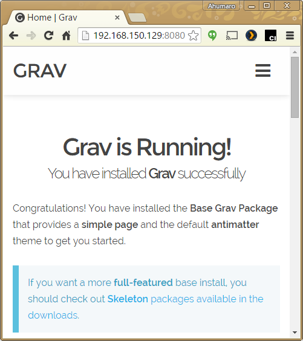

When we talk about Content Management Systems, major names comes to our minds like Drupal, Joomla or WordPress, but if we want a modern, simple but also very powerful CMS, Grav is the new comer to this game.

Now, If we pair Grav CMS with Docker and Nginx, we have a very light and eficient team for the win in a small footprint.

#### One process per container or not

In theory, the use of Docker and containers encourage the **_one process per container_** approach but, from the point of view of software as a service, maybe we can focus this article with the philosophy of **_one service per container_**. 

#### Dockerfile step-by-step

Lets try it. Lets create a new Docker container and inside it, lets buils our CMS stack with Nginx, PHP and Grav in a few easy steps. All of this builded automatically by docker and guided by a Dokerfile.

##### Step 0: Phusion as a base container

```
FROM phusion/baseimage:0.9.16
```
With this Dockerfile instruction, Phusion will be the base image for this container. Version 0.9.16 is based on **Ubuntu 14.04 LTS**
>>>>> Usually, a docker container is based in a Linux distro, it depends on your needs but, sometimes, the distro is too fat, not very friendly nor efficient living in a container. Thats way solutions like Phusion comes in handy due to its extra utilities and its lightweight footprint. For more information: [**Phusion Github**](https://github.com/phusion/baseimage-docker).

##### Step 1: Install core packages

```
#Install core packages
RUN apt-get update -q
RUN apt-get upgrade -y -q
RUN apt-get install -y -q php5 php5-cli php5-fpm php5-gd php5-curl php5-apcu ca-certificates nginx git-core
RUN apt-get clean -q && rm -rf /var/lib/apt/lists/* /tmp/* /var/tmp/*
```
Instructions to install the core packages for the container like nginx, php and git

##### Step 2: Get latest Grav from Git and install it

```
#Get Grav
RUN rm -fR /usr/share/nginx/html/
RUN git clone https://github.com/getgrav/grav.git /usr/share/nginx/html/

#Install Grav
WORKDIR /usr/share/nginx/html/
RUN bin/composer.phar self-update
RUN bin/grav install
RUN chown www-data:www-data .
RUN chown -R www-data:www-data *
RUN find . -type f | xargs chmod 664
RUN find . -type d | xargs chmod 775
RUN find . -type d | xargs chmod +s
RUN umask 0002
```
Instructions to checkout Grav from Github and then run installation scripts. Also assign permissions for the Grav folders. 

##### Step 3: Setup Grav inside Nginx

```
#Configure Nginx - enable gzip
RUN sed -i 's|# gzip_types|  gzip_types|' /etc/nginx/nginx.conf

#Setup Grav configuration for Nginx
RUN touch /etc/nginx/grav_conf.sh
RUN chmod +x /etc/nginx/grav_conf.sh
RUN echo '#!/bin/bash \n\
    echo "" > /etc/nginx/sites-available/default \n\
    ok="0" \n\
    while IFS="" read line \n\
    do \n\
        if [ "$line" = "    server {" ]; then \n\
            ok="1" \n\
        fi \n\
        if [ "$line" = "}" ]; then \n\
            ok="0" \n\
        fi \n\
        if [ "$ok" = "1" ]; then \n\
            echo "$line" >> /etc/nginx/sites-available/default \n\
        fi \n\
    done < /usr/share/nginx/html/nginx.conf' >> /etc/nginx/grav_conf.sh
RUN /etc/nginx/grav_conf.sh
RUN sed -i \
        -e 's|root   html|root   /usr/share/nginx/html|' \
        -e 's|127.0.0.1:9000;|unix:/var/run/php5-fpm.sock;|' \
    /etc/nginx/sites-available/default
```
The previous instructions look a little trickier but in fact they do a very easy task: put the Grav configuration instructions inside Nginx.

Grav comes with a Nginx configuration file in the root of the installation and the previous script reads this configuration and writes it inside Nginx available sites.  

##### Step 4: Setup PHP, Nginx and SSH daemon services

```
#Setup Php service
RUN mkdir -p /etc/service/php5-fpm
RUN touch /etc/service/php5-fpm/run
RUN chmod +x /etc/service/php5-fpm/run
RUN echo '#!/bin/bash \n\
    exec /usr/sbin/php5-fpm -F' >> /etc/service/php5-fpm/run

#Setup Nginx service
RUN mkdir -p /etc/service/nginx
RUN touch /etc/service/nginx/run
RUN chmod +x /etc/service/nginx/run
RUN echo '#!/bin/bash \n\
    exec /usr/sbin/nginx -g "daemon off;"' >>  /etc/service/nginx/run

#Setup SSH service
RUN sed -i \
        -e 's|#PasswordAuthentication no|PasswordAuthentication no|' \
        -e 's|#UsePAM yes|UsePAM no|' \
    /etc/ssh/sshd_config
RUN rm -f /etc/service/sshd/down
RUN /etc/my_init.d/00_regen_ssh_host_keys.sh
```
The first two parts write a small script that runs the PHP and Nginx services at boot time of the container. This service keeps track of those daemons and restart it they die.

The last part enables SSH service and disables password login for security reasons. Later you can inject your SSH public key so you can login to the container in a very secure way.

##### Step 5: Expose volumes and ports

```
#Expose configuration and content volumes
VOLUME /root/.ssh/ /etc/nginx/ /usr/share/nginx/html/

#Public ports
EXPOSE 80 22
```
Those instructions expose some folders to the host system: _Grav root folder_, _Nginx configuration folder_ and _SSH user configuration folder_. Also expose ports 80 and 22. Later on, you can redirect those ports.

With the volumes exposed, you can access directly to those folders from the host if you need to (for example to inject your SSH public key in the SSH user configuration folder of the container)

#### Build and run the container

Now the Dockerfile is ready the next step is to build the container and run it. In the same folder where the Dockerfile relies, run the following instructions from your host OS:

```
root [ ~ ]# docker build -t ahumaro/grav-php-nginx:0.0.1 .
```
In my case I am using **ahumaro/grav-php-nginx** as the tag for my image and **0.0.1** as the version. Once the process ends, you can yun your new image with the following command:
```
root [ ~ ]# docker run -d -p 8080:80 -p 2222:22 ahumaro/grav-php-nginx:0.0.1
```
Here you can see how you can redirect the ports. For example, port 22 of the container will be redirected to port 2222 in the host. To access your container make a ssh connection to port 2222 on yout host.  

#### Test the final product

The new container is up running. Nginx and Grav is ready to handle new petitions so lets try it. Open a broser and point it to the host machine with port 8080, this will redirect the petition to por 80 on the container where Nginx-Grav is watting. You will get the following result:



#### Next steps and recommendations

Now you are ready tu run but don't forget there are many more posibilities that you can explore. For example:

+ How to find the exposed volumes on the host is very easy, fist find the ID of the running container with the following command:
  ```
  root [ ~ ]# docker ps
  CONTAINER ID        IMAGE                           COMMAND             CREATED             STATUS              PORTS                                        NAMES
  560abd21e5a4        ahumaro/grav-php-nginx:latest   "/sbin/my_init"     16 minutes ago      Up 16 minutes       0.0.0.0:2223->22/tcp, 0.0.0.0:8080->80/tcp   nostalgic_babbage
  ```
  With the ID, inspect the container and look for the section **Volumes** 
  ```
  root [ ~ ]# docker inspect 560abd21e5a4
  ...
  "Volumes": {
        "/etc/nginx": "/var/lib/docker/vfs/dir/7e618a0800605659352f5f69ab2c58eee555a7f725a3ef46f016e2d269d1e11e",
        "/root/.ssh": "/var/lib/docker/vfs/dir/24db3321bd511e2134dd3f6487707e62accd2bcbf2cfd299773aba9c7cb79a18",
        "/usr/share/nginx/html": "/var/lib/docker/vfs/dir/5c927c2485052a57e70ea66bda9911479e581eceb891f5ea12a38f061a209591"
  ...
  ```
  Now you can see the mappings and you can access those folders from the host, for example, you can insert your SSH public key inside SSH user config folder of the container
  ```
  cat my_ssh_key.pub > /var/lib/docker/vfs/dir/24db3321bd511e2134dd3f6487707e62accd2bcbf2cfd299773aba9c7cb79a18/authorized_keys
  ```
  And test a conection to the container
  ```
  ssh -i my_ssh_key -p 2222 root@ip-to-your-host
  ```
+ For the management of the Grav CMS content, there are many strategies. You can access the root folder from the volumes exposed. Also you can access directly to the container via SSH. The way I recommend is to synchronize the user folder of Grav (/usr/share/nginx/html/user) to a Git repository and just pull new changes inside it.

+ Don't forget you can run your containers on the cloud with services like [Amazon EC2](http://aws.amazon.com/ec2/), [Golgle Compute Engine](https://cloud.google.com/compute/) or [Digital Ocean](http://www.digitalocean.com) amog others. I like a lot the Google service but if you want a cheaper and good option you can go with Digital Ocean. 

+ Remember that you can find [my Grav-PHP-Nginx Dockerfile on Github](https://github.com/ahumaro/Grav-PHP-Nginx) ready to build or, if you are in a hurry, just get [my pre-builded Docker image ready to run at Docker Hub](https://registry.hub.docker.com/u/ahumaro/grav-php-nginx/).

### Keep exploring and enjoy!

**Ahumaro Mendoza**<br/>
ahumaro@ahumaro.com<br/>
www.ahumaro.com