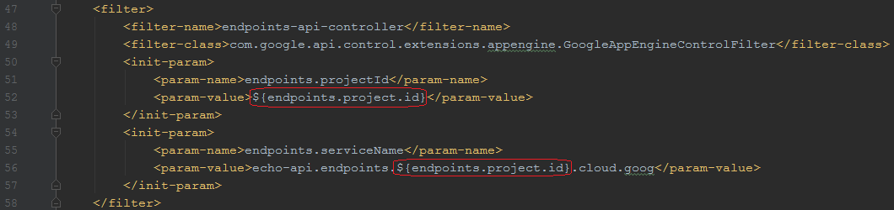
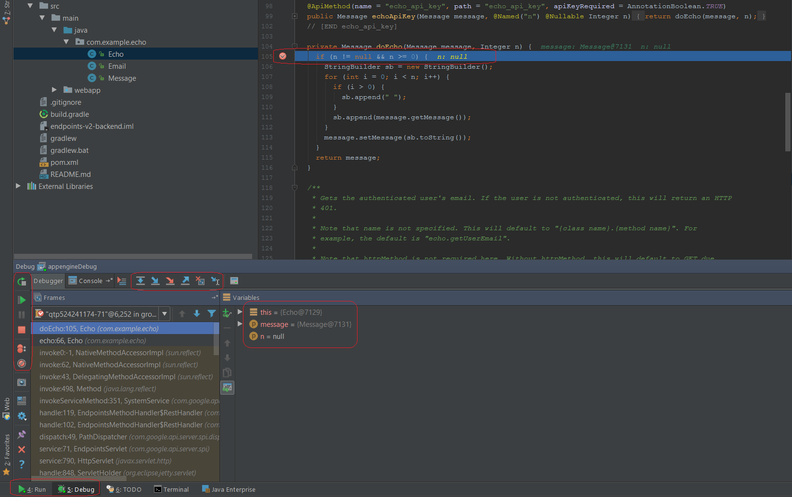

#### Platform as a Service (PaaS) or the so called Serverless infrastructure

At the present time, when we talk about Cloud Computing the first scenarios we think about are Virtual Machines hosted somewhere in the cloud, managed by ourselves and with complete freedom to customize the O.S. and all the tools and frameworks a la carte. Other scenario are the so popular Containers, like Docker, where we can create microservices and can be managed with some kind of orchestration system like Kubernetes.

But, there is another scenario, IMHO, the most forgotten and less marketed of all: The so called Serverless, or, being strict, the **Platform as a Service (PaaS)** scenario. In this environment, you are not able to manage a virtual machine nor a container. You only focus all your effort in your applications and you can deploy your code into this infrastructure and the platform is in charge to run, scale, and protect your invention.

It’s marvelous because you only pay what you use, and you are free of the concernings of actualizations of the O.S., scaling and all that bad nightmares. 

All these goodies don't come at a free price of course. There are some restrictions you have to live with, like the languages supported and, in some cases, you cannot use the full set of the language selected (in the case of Java, for example, multithreading, sockets, etc.).

If you can live with those caveats, then, try it, you will be glad for the simplicity and effortless of putting some code in the cloud.

One of those infrastructures among others is **Google App Engine**. It’s very easy to use and really affordable. The best of all, your code runs on the same infrastructure Google use for some if its products. Also, many frameworks can run on top of it, for example, **Google Cloud Endpoints**: One of the best and easiest ways to build and publish an API that can be consumed by iOS, Android and Web clients. It can be a RESTful API, a gRPC based, Open API, among others.


>>>>>> For more information about **PaaS**, **GAE** and **GCE** use the following links:

>>>>>> [**Platform as a Service (PaaS)**](https://en.wikipedia.org/wiki/Platform_as_a_service)
>>>>>> **|** [**Google App Engine**](https://cloud.google.com/appengine)
>>>>>> **|** [**Google Cloud Endpoints**](https://cloud.google.com/endpoints/)

#### Using an IDE for coding and debugging

Using an **IDE** is not a rule when you are going to develop some code for Google App Engine. Google has developed the frameworks with an IDE agnostic way in mind so you can even use notepad or vi to develop your product.

You can use **Maven** or **Gradle** to perform some of the basic tasks in the build chain and also you can generate the required artifacts to deploy your next API in the cloud.

In the other hand, for some tasks, it’s easier to have a good IDE where you can have code completion, refactoring and all those sweeteners at developing time.

You can use any IDE you want, **Eclipse** is very common and widely spreaded. This time I will be using **IntelliJ** but the theory is the same for any IDE you want.

Under the hood we will be using Gradle tools to perform the build and deploy tasks but the IDE will help us at coding time and also to debug step by step the code that will be running via **Gradle** and using the remote debugger capability of the IDE.

>>>>>> **IMPORTANT**: For simplicity, there are some steps omitted. Only the strictly necessary steps to make the project run and debug in the IDE are depicted in this article.

>>>>>> Use this link to find out more information about developing an API using Google Cloud Endpoints and all the required steps and best practices: [**Google Cloud Endpoints Documentation**](https://cloud.google.com/endpoints/docs/)

#### Importing the project into IDE

For demonstration purposes, we will use one of the examples available in the Google’s Git repository: The **Google Cloud Endpoints backend** example.

>>>>>> In the following link you can get the full set of examples developed by Google to demonstrate some of the Google Cloud capabilities: [**java-docs-samples**](https://github.com/GoogleCloudPlatform/java-docs-samples)

>>>>>> We will be working with this particular example: [**App Engine Standard & Google Cloud Endpoints Frameworks & Java**](https://github.com/GoogleCloudPlatform/java-docs-samples/tree/master/appengine-java8/endpoints-v2-backend)

Checkout the code and store it somewhere in your computer. Then, open your IDE, in this case I will be using **IntelliJ**.

1. Select **Import Project** from the main initial menu.
   # 

2. Select **build.gradle** from the folder **java-docs-samples-master/java-docs-samples-master/appengine-java8i/endpoints-v2-backend**
   # 

3. Use the following settings to import the gradle project.
   # 

4. After the import, this is the project tree you will get.
   # 

#### Initialize the code for first build / run.

>>>>>> In order to use Google Cloud Endpoints, you must have a project previously created using the console or the CLI tools and have enabled the Endpoints API for that project.

Now you have the project into the IDE, it's time to customize a little the code and the configuration in order to get a sucesful build and run.

1. Edit **build.gradle** to change '**YOUR_PROJECT_ID**' according to your project ID. (You can find your project ID using the Google Cloud console).
   # 

2. Every time you modify build.gradle, the IDE will ask you to Import Changes. Agree with that every time or click on **Enable Auto-Import**.
   # 

3. Edit **appengine-web.xml** and replace **${endpoints.project.id}** with your project ID.
   # 

4. Edit **web.xml** and replace **${endpoints.project.id}** with your project ID.
   # 

5. Build the project using the **build** task in the Gradle tab on the right side of the IDE. (double click to run).
   # 

6. This is the output of a succesful build.
   # 

7. In order to run the code, we will make a new Run configuration. Select **Edit Configurations** from the Run menu.
   # 

8. Click in the Plus sign and select **Gradle**.
   # 

9. Type a name for the new Run configuration and specify **appEngineRun** in the Task field because we will be invoking that Gradle task.
   # 

10. Run the project: Select the new Run configuration and click the run button.
   # 

11. This is the output of the running project.
   # 

12. Use **curl** to make a request for the API using this command:
 ```
 curl -H "Content-Type: application/json" -X POST -d '{"message":"hello world"}' http://localhost:8080/_ah/api/echo/v1/echo
 ```

   # 

 >>>>>> If you are using Windows and don't have curl, you can download it here at: [**curl downloads**](https://curl.haxx.se/download.html)

#### Directives to make the code debuggable

In the previous steps we got a compiling and running project, but, since the project runs using an external Gradle script, the IDE is not capable of capture the process and debug step by step the code. The following steps will make that posible.

>>>>>> For a complete customizations of the Gradle plugin for Google App Engine, you can visit the oficial Gradle plugin page at: [**Google App Engine Gradle plugin**](https://github.com/GoogleCloudPlatform/app-gradle-plugin)  
>>>>>>


>>>>>> The following steps where based in the [**GAE Gradle plugin User Guide**](https://github.com/GoogleCloudPlatform/app-gradle-plugin/blob/master/USER_GUIDE.md)
>>>>>>


1. Edit **build.gradle** and insert the following code to make debuggable our project.

 ```
 appengine {
      run {
          jvmFlags = ["-Xdebug", "-Xrunjdwp:transport=dt_socket,server=y,suspend=y,address=5005"]
      }
 }
 ```

 Sometimes you will have a warning in the IDE but you can ignore that.

 # 

2. Run again the project and you will see the execution waits for the debugger to connect.
   # 

#### Remote debug on the IDE

1. Apart from the Run configuration, we will make a new config but now using the **Remote** options in order to connect to the running gradle process.
   # 

2. In the configuration, verify that the **port** is the same as the running Gradle process of the previous steps. **5005** in this case.
   # 

3. Select the new **Remote config** and click the **Debug** button to start the debugger.
   # 

4. In the output you can see the succesfull connection between the remote debugger and the running Gradle task.
   # 

5. Now you can set breakpoints  and use the IDE to debug step by step your project with ease.
   # 

### Keep exploring and enjoy!

**Ahumaro Mendoza**<br/>
ahumaro@ahumaro.com<br/>
www.ahumaro.com
